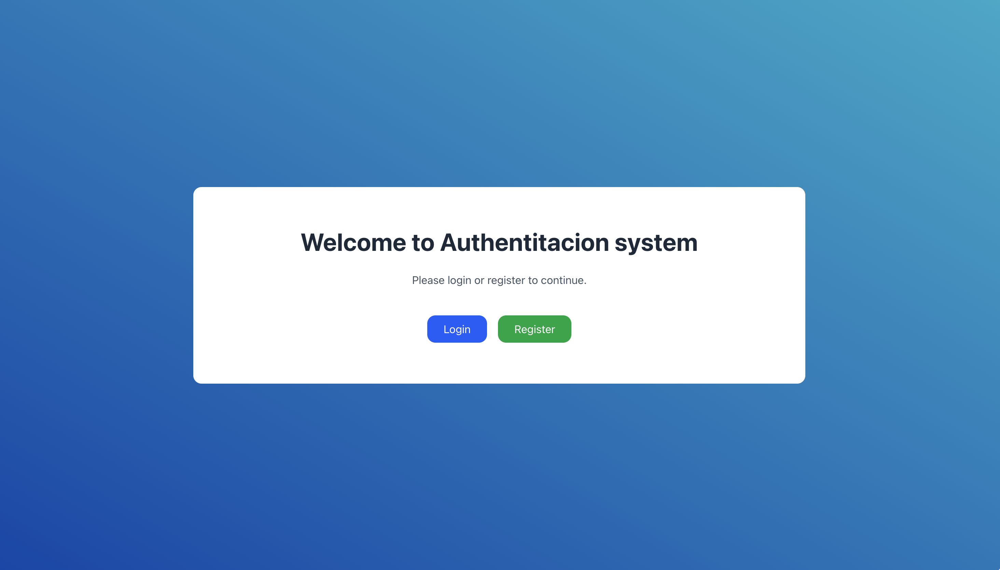
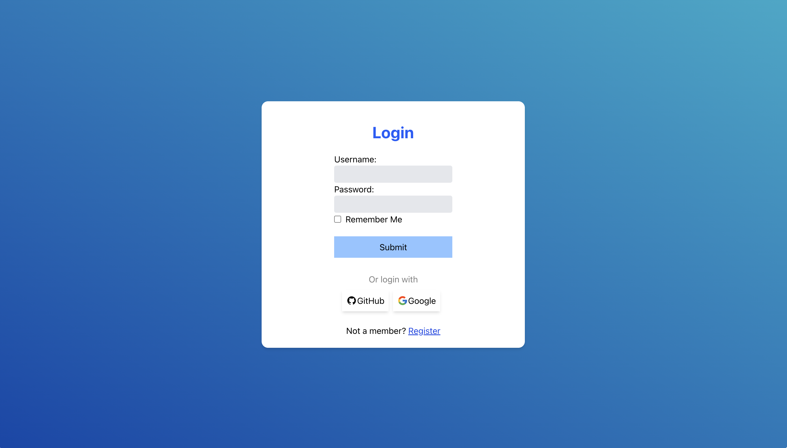
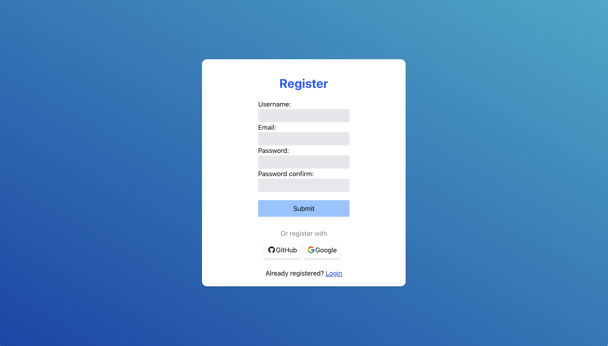
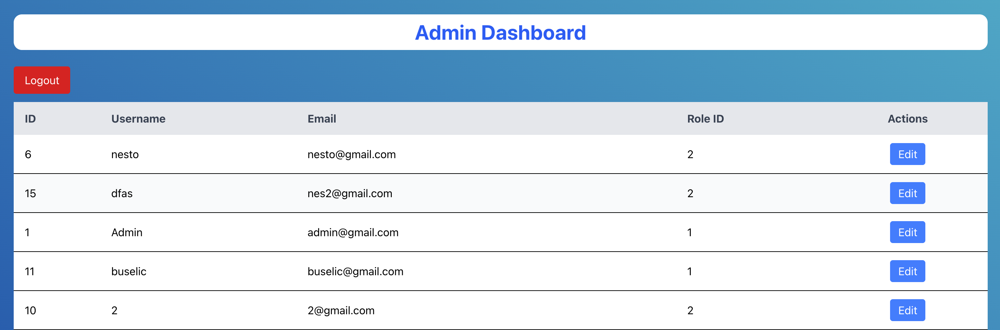
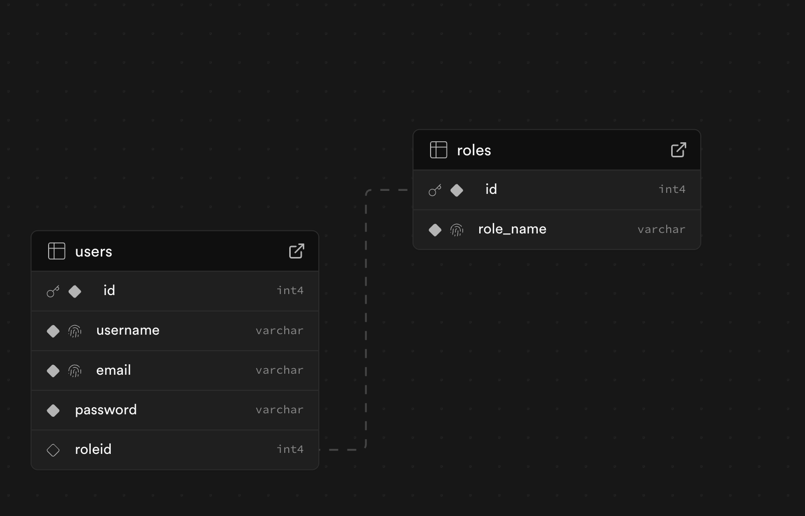
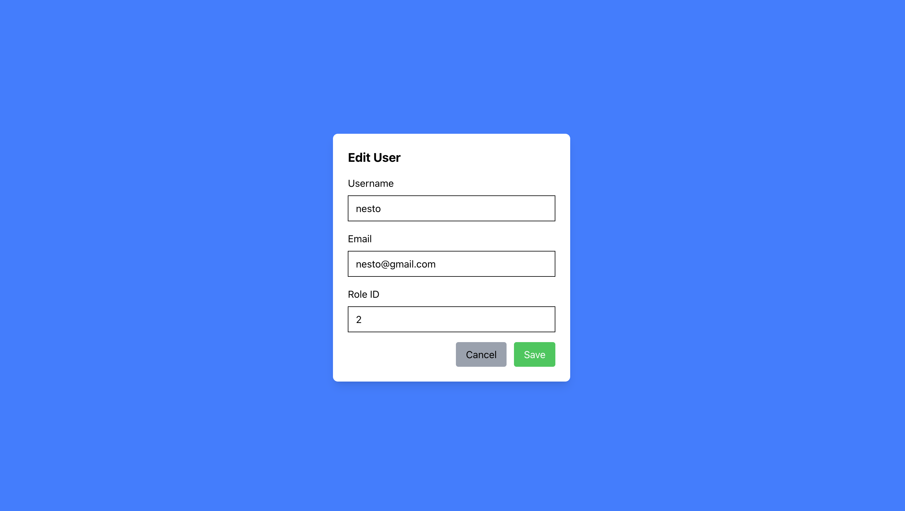

# Authentication System with Roles and Permissions

This project is a full-stack **authentication system** built using modern technologies including **Next.js** for the frontend, **Flask** (Python) for the backend API, and **Supabase** as the database backend. It implements user authentication with role-based access control (RBAC), allowing different permissions based on user roles. Passwords are securely hashed using **Werkzeug** to protect user credentials.

---

## Table of Contents

- [Features](#features)  
- [Screenshots](#screenshots)  
- [Technologies Used](#technologies-used)  
- [Setup & Installation](#setup--installation)  
- [Environment Variables](#environment-variables)

---

## Features

- **User Registration & Login:**  
  New users can register with an email and password. Passwords are hashed using Werkzeug’s secure hashing functions before storing in the database. Existing users can log in to access their accounts.

- **Role-Based Access Control:**  
  The system supports roles assigned to users:  
  - **Admin** (role ID 1): Full control except for changing user passwords. Admins can edit user emails, usernames, and roles, including promoting other users to admins.  
  - **User** (role ID 2)

- **Admin Panel:**  
  Admin users have access to an admin dashboard where they can view all registered users, edit their details (excluding passwords), and assign roles.

- **Logout Functionality:**  
  Users can securely log out, terminating their session.

- **Database:**  
  Uses **Supabase** (PostgreSQL) to store user data, roles, and permissions.

- **Password Security:**  
  Passwords are never stored in plain text. They are hashed using **Werkzeug**, which provides a secure and tested hashing mechanism.

- **Frontend:**  
  Built with **Next.js**, a React framework supporting server-side rendering and static site generation, enhancing performance and SEO.

---

## Screenshots

Below are some screenshots showcasing key parts of the application:


*Home design*

  
*Login page where users enter their credentials.*

  
*User profile page showing editable details.*

  
*Admin panel for managing users and their roles.*


*Supabase Database where everything is stored.*


*Admin can change information about users using his app.*


---

## Technologies Used

- **Frontend:** Next.js (React)  
- **Backend:** Flask (Python)  
- **Database:** Supabase (PostgreSQL)  
- **ORM:** SQLAlchemy (for database interaction) 
- **Password Hashing:** Werkzeug  
- **Authentication & Authorization:** Custom implementation with roles and permissions  
- **Environment Configuration:** Python dotenv or similar for loading `.env` variables

---

## Setup & Installation

Follow these steps to get the project up and running on your local machine.

### 1. Clone the Repository

Open your terminal and clone the repo using:

```bash
git clone https://github.com/yourusername/authentication-system-with-roles-and-permissions.git
cd authentication-system-with-roles-and-permissions
```


### 2. Install Backend Dependencies

Navigate to the backend directory and install the required Python packages:

```bash
pip install -r backend/requirements.txt
```

### 3. Install Frontend Dependencies and Build the Next.js App

Navigate to the frontend directory and install Node.js dependencies, then build the app:

```bash
cd frontend
npm install
npm run build
```

### 4. Run the Backend Server

Go back to the backend folder and start the Flask server:

```bash
cd ../backend
python3 app.py
```

### Environment Variables

For the backend Flask server to work correctly, create a .env file inside the backend folder with the following variables:

```bash
SECRET_KEY=your_flask_secret_key
SQLALCHEMY_DATABASE_URI=your_database_connection_string
```